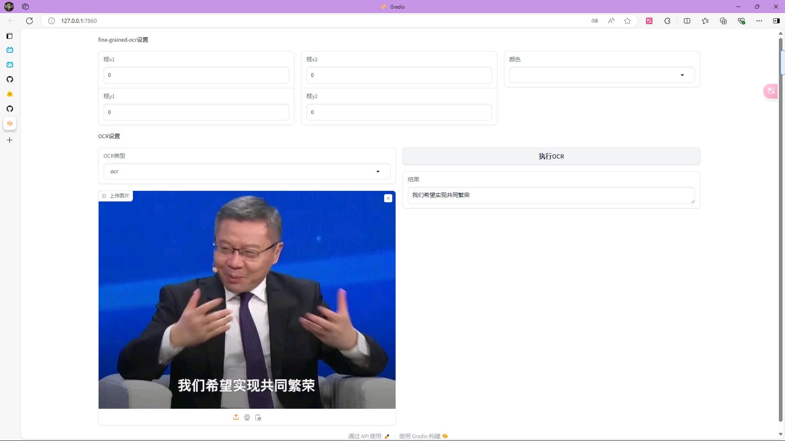

# GOT-OCR-2-GUI

## 关于此项目

模型权重：https://hf-mirror.com/stepfun-ai/GOT-OCR2_0 

原Github：https://github.com/Ucas-HaoranWei/GOT-OCR2.0/

点个star吧

## 转换为pdf已在ZH_CN脚本中可用

## 使用方法
### 依赖
#### 使用`pip`安装
- gradio
- transformers
- pdfkit
- beautifulsoup4
#### 其他
- [wkhtmltopdf](https://wkhtmltopdf.org/downloads.html)，下载压缩包，解压放进`wkhtmltopdf`文件夹中
- 文件结构应该是：
```
GOT-OCR-2-GUI
├─wkhtmltopdf
│  ├─bin
│  │  ├─wkhtmltopdf.exe
│  │  ├─wkhtmltox.dll
│  │  ├─libwkhtmltox.a
│  │  └─wkhtmltoimage.exe
│  └─include
│     └─wkhtmltox
│        └─...
```

### 模型文件
> 如果这里面提到的文件夹你没有，那就新建一个
1. 下载到`models`文件夹中
2. 别少下载文件了
3. 选一个你喜欢的脚本打开
4. 用GUI的可以不管，不过用CLI的各位记得把要OCR的图放进`imgs`文件夹里（CLI目前只检测`.jpg`和`.png`图片）

## 其他
- 非必要不要下载`tests`文件夹中的内容
- 脚本闪退的话可以试一下用`cmd`跑`python +文件名`，我自己测试时会出现闪退的情况，我也不知道为什么
