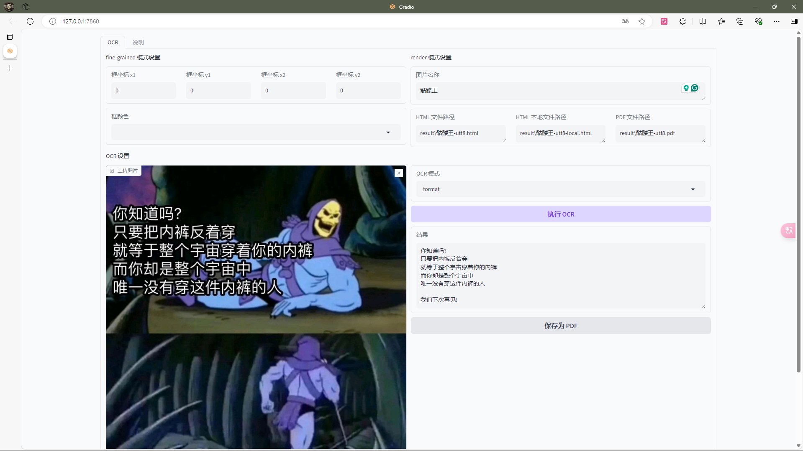

# GOT-OCR-2-GUI
## [See English version here](README-en.md)


## 关于此项目

模型权重：https://hf-mirror.com/stepfun-ai/GOT-OCR2_0  
原Github：https://github.com/Ucas-HaoranWei/GOT-OCR2.0/  
感谢GLM4提供的一部分代码（因为本人实在是菜，所以不得不用一下AI）  
其实CLI的开发比GUI还要慢，不过我现在打算先把GUI的改动同步到CLI，然后先更新CLI，等CLI稳定后再更新GUI

点个star吧

## 转换为pdf已在`GUI-ZH_CN`和`GUI-EN`中可用，CLI中暂不可用

## 使用方法
> 如果这里面提到的文件夹你没有，那就新建一个
### 依赖
#### 使用`pip`安装
- 参考`requirements.txt`
```commandline
pip install -r requirements.txt
```
#### 其他
- [wkhtmltopdf](https://wkhtmltopdf.org/downloads.html)，下载压缩包，解压放进`wkhtmltopdf`文件夹中
> 文件结构应该是：
> ```
> GOT-OCR-2-GUI
> ├─wkhtmltopdf
> │  ├─bin
> │  │  ├─wkhtmltopdf.exe
> │  │  ├─wkhtmltox.dll
> │  │  ├─libwkhtmltox.a
> │  │  └─wkhtmltoimage.exe
> │  └─include
> │     └─wkhtmltox
> │        └─...
> ```
- [Edge WebDriver](https://developer.microsoft.com/zh-cn/microsoft-edge/tools/webdriver/?form=MA13LH#downloads)，下载压缩包，放进`edge_driver`文件夹中
> 用来转pdf的，但是暂时还没有正式上线  
> 文件结构应该是：
> ```
> GOT-OCR-2-GUI
> └─edge_driver
>    ├─msedgedriver.exe
>    └─...
> ```

### 下载模型文件
1. 下载到`models`文件夹中
2. 别少下载文件了
- 文件结构应该是：
```
GOT-OCR-2-GUI
├─models
│  ├─model.safetensors
│  ├─config.json
│  └─你在huggingface下载的其他文件
└─...
```
### 开始使用
1. 选一个你喜欢的脚本打开
2. 用GUI的可以不管，不过用CLI的各位记得把要OCR的图放进`imgs`文件夹里（CLI目前只检测`.jpg`和`.png`图片）

## 其他
- 转pdf的功能暂时还不能正确渲染LaTeX，慎重使用
- 脚本闪退的话可以试一下用`cmd`跑`python +文件名`，我自己测试时会出现闪退的情况，我也不知道为什么
